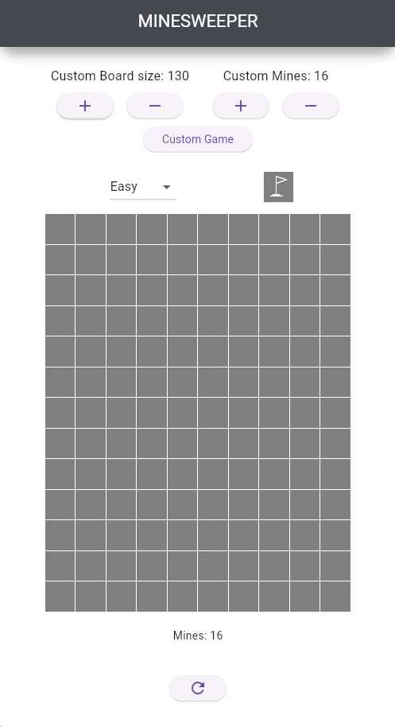

# Minesweeper for Mobile

A modern Minesweeper game built using Flutter, designed for mobile devices. The game provides a fun and challenging way to test your logic skills, complete with varying difficulty levels and smooth gameplay.

## Getting Started
🎮 Features
  - Classic Minesweeper Gameplay:
    - Reveal cells to avoid mines and clear the board.
    - Use flag button to be able to flag / unflag a tile.
  - Dynamic Difficulty:
    - Choose from multiple difficulty levels: Easy, Medium, Hard, or create a Custom level (work in progress).
  - Interactive Design:
    - Intuitive touch controls for seamless gameplay.
    - Real-time feedback with visual indicators (e.g., color-coded results for win/loss).
      
📱 Screenshots

